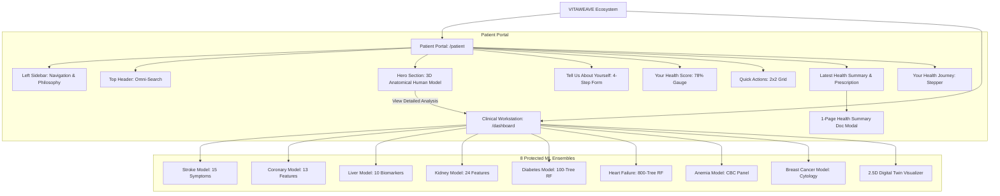

# VITAWEAVE — Frontend Design & Visual System Architecture

> **Official Design System Specification & Component Architecture**  
> *VITAWEAVE Public Healthcare & Clinical Intelligence Ecosystem*

---

## 🏛️ Design Philosophy & Core Principles

VITAWEAVE is designed to embody a modern, highly credible public healthcare platform upgraded with state-of-the-art 3D anatomical visualization and machine learning intelligence. The user experience balances medical trust with high-tech clinical innovation.

```
┌────────────────────────────────────────────────────────────────────────┐
│                        DESIGN BALANCING RATIO                         │
├──────────────────────────────┬────────────────────────┬────────────────┤
│  70% Government Healthcare   │  20% Modern Tech UI   │ 10% 3D Visual  │
│  Restrained, White, Accessible │  Responsive, Smooth   │ Holographic, 3D│
└──────────────────────────────┴────────────────────────┴────────────────┘
```

### Key Design Pillars
1. **Medical Credibility & Visual Restraint**: Clean white surfaces, subtle borders, high whitespace, and professional medical typography. Strictly avoids flashy gaming, neon-heavy, or cluttered startup aesthetics.
2. **Dual-Portal Synchronization**: Unified product experience serving both **Patients** (`/patient`) and **Clinicians** (`/dashboard`).
3. **Truthful Medical States**: No fabricated diagnostic predictions. Organ states display truthful statuses (*"Assessment Available"*, *"Not Assessed"*, *"Requires Clinician Review"*).
4. **Lightweight 3D Anatomical Intelligence**: High-performance 2.5D and 3D Canvas visualizers that run at 60fps on modern devices without bloated external rendering engines.

---

## 🎨 Color Palette & Design Tokens

### Primary Theme (Light Mode Default)
VITAWEAVE utilizes a curated light-mode palette tailored for high legibility, public sector accessibility, and medical precision.

| Token | Hex Value | Application |
|-------|-----------|-------------|
| **Base Surface** | `#FFFFFF` | Primary cards, document canvas, sidebar |
| **Page Background** | `#F8FAFC` | Main application background (Slate 50) |
| **Subtle Container** | `#F1F5F9` | Secondary cards, hover surfaces, inputs (Slate 100) |
| **Dark Navy Text** | `#0F172A` | Headlines, primary text, brand titles (Slate 900) |
| **Muted Text** | `#475569` / `#64748B` | Subtitles, metadata, form labels (Slate 500/600) |
| **Medical Blue (Primary)** | `#0284C7` / `#2563EB` | Primary buttons, active tabs, hero highlights |
| **Cyan Accent** | `#06B6D4` | 3D pedestal glow, orbital rings, subtle highlights |
| **Violet Accent** | `#7C3AED` | AI Assistant badges, secondary metrics |
| **Positive State (Mint)** | `#059669` / `#10B981` | Healthy indicators, completed steps, valid vitals |
| **Warning State** | `#D97706` / `#E11D48` | Risk band indicators, pending clinician signatures |

---

## 📐 Product Architecture & Routing



---

## 🧱 Component Hierarchy

### 1. Patient Portal (`client/app/patient/`)
- **`page.tsx`**: Patient Dashboard Shell containing sidebar, header, hero section, health score, quick actions, records, and journey timeline.
- **`HumanBody3D.tsx`**: Interactive 3D Canvas anatomical human visualization:
  - Semi-transparent wireframe point cloud with depth projection.
  - Holographic circular pedestal with concentric cyan/blue orbital rings.
  - Floating organ badges (*Brain, Heart, Lungs, Liver, Kidney, Gut*).
  - Mouse drag rotation (orbit X/Y), auto-rotation, scroll zoom, and clickable organ nodes.
- **`HealthSummaryDoc.tsx`**: Government-grade one-page medical document modal:
  - Official VITAWEAVE header & patient demographics (*Anushka Verma, Age 26, VW-28473*).
  - 8-model assessment matrix, reported history, and preventive recommendations.
  - Statutory warning: *"Pending Clinician Counter-Signature"*.
  - Export triggers: Native **Print / Save PDF**, **PNG**, and **JPG** canvas rasterization.

### 2. Clinical Workstation (`client/app/dashboard/`)
- **`page.tsx`**: Doctor / Clinical Intelligence Workstation shell:
  - Responsive model switcher (mobile dropdown menu, desktop pill tabs).
  - Feature input panels, live biomarker sliders, presets, decision tree parameter attribution.
  - Clinical copilot natural language Q&A assistant.
- **`ClinicalCore.tsx`**: 2.5D Organ Digital Twin visualizer rendering organ structures, scanning lines, and factor heatmaps.
- **`KidneyInputForm.tsx`**: Specialized clinical input panel for Chronic Kidney Disease parameters.
- **ML Inference Engines**:
  - `stroke-inference.ts`
  - `heart-disease-inference.ts`
  - `liver-disease-inference.ts`
  - `kidney-disease-inference.ts`
  - `diabetes-inference.ts`
  - `heart-failure-inference.ts`
  - `anemia-inference.ts`
  - `breast-cancer-inference.ts`

---

## ⚡ 3D & Digital Twin Technology

### 1. 3D Anatomical Human Model (`HumanBody3D`)
- **Canvas Pipeline**: Custom 3D projection engine (`project(p: Point3D)`) translating 3D coordinates $(x, y, z)$ into 2D viewport coordinates $(px, py)$ with camera perspective scaling.
- **Pedestal Shader Simulation**: Concentric radial gradients and vertical light beam blending representing holographic pedestal projection.
- **Performance**: Zero external WebGL wrapper overhead; runs natively on HTML5 Canvas at 60 FPS.

### 2. Organ Digital Twins (`ClinicalCore`)
- **Visuals**: High-resolution 2.5D organ assets (`clinical-brain-twin.jpg`, `clinical-heart-twin.jpg`, etc.) with animated SVG scanning lines and interactive biomarker hotspots.

---

## 📄 One-Page Document & Export Specification

The generated **VITAWEAVE AI-Assisted Health Summary** follows standard public health document guidelines:

1. **Header**: VITAWEAVE Digital Health Mission, Date, Summary ID, Patient ID.
2. **Demographics**: Name, Age, Gender, Blood Group, Height, Weight, BMI.
3. **Clinical Evaluation Matrix**: 8 ML models availability status.
4. **Reported History**: Conditions, allergies, medications, lifestyle factors.
5. **Guidance & Follow-up**: Preventive care tips and follow-up timeline.
6. **Disclaimer Box**: Prominent statutory notice indicating AI decision support requires doctor counter-signature.
7. **Export Pipeline**:
   - **Print / PDF**: Custom CSS `@media print` rule hiding dashboard chrome and isolating the document sheet.
   - **PNG / JPG**: HTML Canvas 2D context drawing engine rendering the exact 800×1130 px document layout for direct download.

---

## 📱 Responsiveness & Breakpoints

- **Desktop (1440px / 1920px)**: 3-column layout (Sidebar + Main Column + Right Rail Column).
- **Tablet (768px - 1024px)**: Collapsible sidebar, 2-column stacked grid, scaled 3D anatomical centerpiece.
- **Mobile (375px - 640px)**: Single column fluid layout, compact dropdown navigation, touch-optimized organ chips.

---

*VITAWEAVE Frontend Architecture · Designed for Public Healthcare Excellence.*
